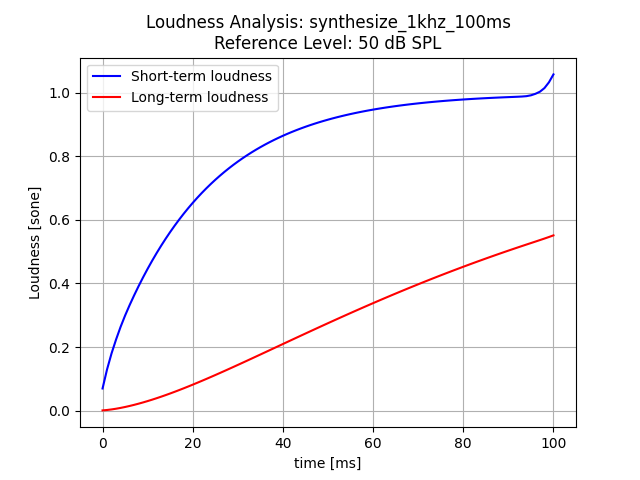

# Python Code for Calculation of the Loudness of Time-Varying Sounds
Jeremy JX Hsiao, Malcolm Slaney </br>
Based on MATLAB Loudness Model provided by Brian C.J. Moore, Brian R. Glasberg and Josef Schlittenlacher

jeremyjxhsiao@gmail.com, malcolm@ieee.org </br>
bcjm@cam.ac.uk, bg12@cam.ac.uk, js2251@cam.ac.uk

## I. INTRODUCTION
This code implements a model of time-varying auditory loudness.
The Python code is based on an original implementation in MATLAB, translated using various Python libraries (NumPy, SciPy, JAX etc.)
The code calculates loudness according to the model described by Moore et 
al. (2016), but with the modified time constants described by Moore et al. (2018). It was
developed from C code for the same model, and Matlab code written for ANSI S3.4-2007,
based on Moore et al. (1997) and Glasberg and Moore (2006) and ISO 532-2 (2017), 
based on Moore and Glasberg (2007). The source code is provided free for any research purposes.

A link to the original MATLAB code is the first download on this page: 
https://www.psychol.cam.ac.uk/hearing#programs

## II. RUNNING THE PROGRAM
The function main_tv2018 takes five parameters: 

`main_tv2018(filename_or_sound: Union[str, np.ndarray], db_max:** float, filename_filter: str, output_path: str = None, rate: int = None)`

**filename_or_sound**: This can either be a path to a file name, a NumPy array of audio data with rate specified, or you can create your own synthesized signal by inputting "synthesize_{}khz_{}ms" into filename_or_sound. If path to file name is provided, SciPy wavfile read will extract audio data and rate. If NumPY array is provided, the rate must be specified. If a synthesized signal is provided, the rate will automatically be set to 32000. 

**db_max**: The root-mean-square sound pressure level of a full-scale sinusoid, i.e. a sinusoid whose peak amplitude is 1 in Matlab. This allows calibration of absolute level. A range of 0 to 40 dB is considered quiet to very quiet, while 60 to 80 dB is generally described as noisy. A default value for this could be 50. 

**filter_filename**: The filename of the filter that specifies the transfer function through the outer and middle ear. Use ‘ff_32000.mat’ for free-field presentation, 
‘df_32000.mat’ for diffuse-field presentation or ‘ed_32000.mat’ for middle-ear only (when the signal is picked up at the eardrum, or headphones with a “flat” frequency response at the eardrum are used).

**rate**: The sampling rate of the signal, can be specified. If providing your own array data for the signal, be sure to specify rate. 

**debug_plot**: Whether to produce a short-term versus long-term loudness plot.

**debug_plot_filename**: Where to store the loudness plot, if **debug_plot** is True.

**debug_summary_filename**: Where to store a textual summary of the loudness.


## III. OUTPUTS OF THE PROGRAM
The function returns three vectors, each of them starting at t = 0 ms and having a step size of 1 ms. The first vector is the instantaneous loudness, the second is the short-term loudness, and the third is long-term loudness, all in sone. 
Optionally, the program creates a text file if the debug_summary_filename argument is not None.
It contains seven columns, specifying the time in ms, instantaneous loudness, short-term loudness and long-term loudness in both sone and loudness level in phon. 
Optionally, the program creates a Matplotlib figure with a black line representing instantaneous loudness, a blue line representing short-term loudness and a red line representing long-term loudness, as shown below: 

**EXAMPLE** </br>

```
filename_or_sound = 'synthesize_1khz_100ms'
db_max = 50
filter_filename = 'transfer functions/ff_32000.mat'
loudness, short_term_loudness, long_term_loudness = main_tv2018(filename_or_sound, db_max, filter_filename, debug_plot=True, debug_plot_filename='results/synthesize_1khz_100ms_50dB_loudness_plot.png', debug_summary_filename='results/synthesize_1khz_100ms_50dB_calibration_level_TVL_2018.txt')
```

Running the code above calculates loudness for the synthesized 1khz 100ms audio data. The signal is a 100-ms segment of a 1000-Hz tone with a level 10 dB below the full-scale level. If a full-scale sinusoid has a level of 50 dB SPL (as specified by the “50” in the example above), the signal in the example wav file would have a level of 40 dB SPL and the outputs show the loudness of a 1-kHz pure tone with a duration of 100 ms and a level of 40 dB SPL. To calculate the loudness of a 1-kHz pure tone with a duration of 100 ms and a level of X dB SPL, specify the full-scale level as X+10. 

**OUTPUTS:** </br>
With the arguments above the main_tv2018 function creates two files: a textual summary and a summary plot:

[Download the generated text file here.](results/synthesize_1khz_100ms_50dB_calibration_level_TVL_2018.txt)




## V. ADDED TESTS AND OPTIMIZATION

[to do]

## VI. SUBROUTINES

You will find many useful subroutines in the main directory and subdirectory ‘functions’. They may be used to calculate excitation patterns, perform a Fast Fourier Transform (FFT), convert sone to phon or Hz to Cam (the units of the ERBN-number scale), calculate the
equivalent rectangular bandwidth of the auditory filter, calculate binaural inhibition, and implement automatic gain circuits, among other things.

## REFERENCES

Glasberg, B. R., and Moore, B. C. J. (2006). "Prediction of absolute thresholds and equal- loudness contours using a modified loudness model," J. Acoust. Soc. Am. 120, 585- 588.

ISO 532-2 (2017). Acoustics - Methods for calculating loudness - Part 2: Moore-Glasberg method (International Organization for Standardization, Geneva).

Moore, B. C. J., and Glasberg, B. R. (2007). "Modeling binaural loudness," J. Acoust. Soc. Am. 121, 1604-1612.

Moore, B. C. J., Glasberg, B. R., and Baer, T. (1997). "A model for the prediction of thresholds, loudness and partial loudness," J. Audio Eng. Soc. 45, 224-240.

Moore, B. C. J., Glasberg, B. R., Varathanathan, A., and Schlittenlacher, J. (2016). "A loudness model for time-varying sounds incorporating binaural inhibition," Trends Hear. 20, 1-16.

Moore, B. C. J., Jervis, M., Harries, L., and Schlittenlacher, J. (2018). "Testing and refining a loudness model for time-varying sounds incorporating binaural inhibition," J. Acoust. Soc. Am. 143, 1504-1513.


